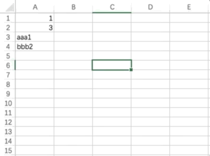
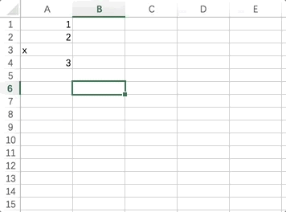
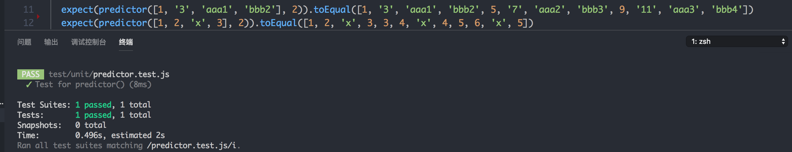

# Smart predictor

`smart-predictor` was inspired by the function `auto fill` from **Microsoft Excel**, which could predicts new values from the given data.

## What is `auto fill`?
Let's look at two gif at first:




Amazing, isn't it? Once I have a sort of data like `[1, 3, 'aaa1', 'bbb2']`, Excel `aufo fill` would give back `[5, 7, 'aaa2', 'bbb3', 9, 11 'aaa3', 'bbb4']` as the result.

What's more, the most interesting things is that only the continuous data would be set as a group, and keep increasing by thier own rule, which means you will get `[3, 4, 'x', 4]` from `[1, 2, 'x', 3]`.

By understanding these conceptions, we could talk about how does it works.

## Separator
We use `[1, 2, 'a1c', 'a2c']` as an example. Once we got an array like this, the first thing we need to do is to analyze its items, wheather an item is a string, a number, or anything else. Then wo could informates them and separates them into a new array.

For example, item `1` could be informated as ↓
```javascript
{
  realValue: 1,
  numericValue: 1,
  splitParts: 'Number',
  index: 0
}
```

and item `a1c` would be like this ↓
```javascript
{
  realValue: 'a1c',
  numericValue: 1,
  splitParts: ['a', 'c'],
  index: 2
}
```

This is what `Separator` does, and now we've got a new array fill with information objects.

## Classifier
The base unit of auto fill is "group". After getting a sepatated array, we should put its items into different group. Grouping contains two details:

1. Datas should have a same *type*, we use `splitParts` as it.
2. Datas should be **continuous**, nor it should be put into a new group.

As the given array `[1, 2, 'a1c', 'a2c', 6, 8]`, item `1` and `2` should be grouping to group `Number`, and item `a1c` and `a2c` should be in group `ac`, but item `6` and `8` would be in a new group `Number1`:
```javascript
{
  'Number': [{
    realValue: '1',
    ...
  }, {
    realValue: '2',
    ...
  }],
  'ac': [{
    realValue: 'a1c',
    ...
  }, {
    realValue: 'a2c',
    ...
  }],
  'Number1': [{
    realValue: '6',
    ...
  }, {
    realValue: '8',
    ...
  }]
}
```

By doing so, all the datas was in different groups, items between groups won't interfer each other. Before predicting values, we should build a function for doing **"linear regression"**.

## Linear regression
"Linear regression" is a math theory, all the details you could found in [wikipedia](https://en.wikipedia.org/wiki/Linear_regression), but in this case, I would use a formula below to get the slope of the regression line:

```
y = ax + b

a = ∑(x−x')(y−y') / ∑(x−x')(x−x')
```

`x'` is the mean value of all the x, and `y'` is the mean value of all the y, too.

As the given array `[1, 3]`, we could get `{ a: 2, b:1 }` very easily by this formula, and predict the next value of this array should be `[5, 7, 9, ...]`.

This is the core of `smart-predictor`, and we would use it to predict values from the classified groups.

## Predictor
With the help of linear regression, we could predict values by setting predict times from the classifed groups one by one, and then combine them into a new array.

As the given classifed groups array from session [Classifier](#Classifier), we may predict its value for once:
```javascript
{
  'Number': [{
    realValue: '1',
    index: 0,
    ...
  }, {
    realValue: '2',
    index: 1,
    ...
  }, {
    realValue: '3',
    index: 6,
    ...
  }, {
    realValue: '4',
    index: 7,
    ...
  }],
  'ac': [{
    realValue: 'a1c',
    index: 2,
    ...
  }, {
    realValue: 'a2c',
    index: 3,
    ...
  }, {
    realValue: 'a3c',
    index: 8,
    ...
  }, {
    realValue: 'a4c',
    index: 9,
    ...
  }],
  'Number1': [{
    realValue: '6',
    index: 4,
    ...
  }, {
    realValue: '8',
    index: 5
    ...
  }, {
    realValue: '10',
    index: 10,
    ...
  }, {
    realValue: '12',
    index: 11
    ...
  }]
}
```

Because we know the index of every datas, it's easy to put them into a new array as the result:
```javascript
[1, 2, 'a1c', 'a2c', 6, 8, 3, 4, 'a3c', 'a4c', 10, 12]
```

Now let's look at the test unit and compare with what [Excel's dose](#What-is-`auto-fill`?):



## More
`smart-predictor` is not smart enough. It can only predicting natural numbers or natural numbers and string combine, but not supports `Date`, `Letters` and so on. It's welcome for all you guys to join this project, and make `smart-predictor` much more clever.

## Lisence
MIT